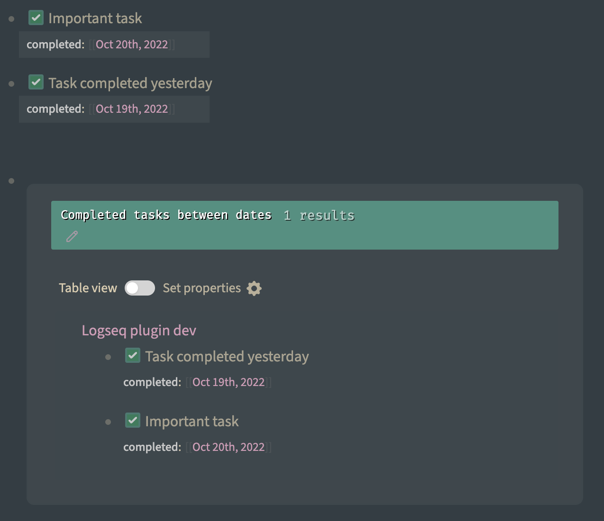

# logseq-plugin-task-check-date

Logseq plugin for tracking when task was done.

## Features
* Adds property "completed" to tasks upon checking
* Useful for gathering weekly\monthly\whatever report



## Report generation
You can use this query:
```clojure
 #+BEGIN_QUERY
{
    :title "Completed tasks between dates"
    :query [
        :find (pull ?b [*])
        :in $ ?start ?end
        :where
            ([(= ?marker "DONE")])
            [?b :block/properties ?properties]
            [(get ?properties :completed) ?completed]
            [(>= ?completed ?start)]
            [(< ?completed ?end)]
    ]
    :inputs [:7d :today]
}
#+END_QUERY
```

You can set any dates in `:inputs`, i.e. `:inputs [:10d :-10d]` means between "today - 10 days" and "today + 10 days".
