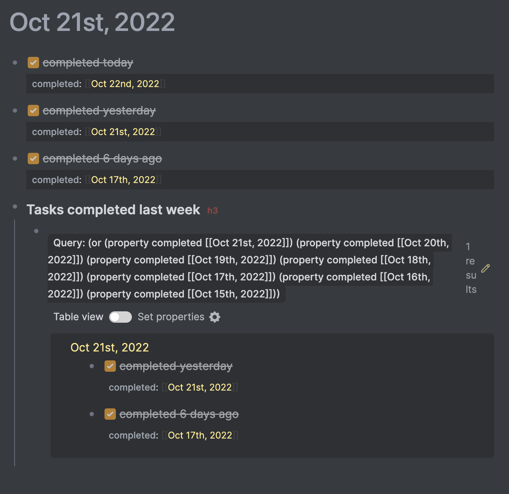

# [Logseq](https://logseq.com) task completion tracker plugin

* Logseq plugin for tracking when task was done. 
* Useful for gathering weekly\monthly\whatever report.
* Look for "Task Completion" in the Marketplace.

## Features
* Adds property "completed" to tasks upon checking
* Adds slash command `Completed tasks for the past week` which queries blocks with `completed` property equal one of 7 past days.
* Has settings for optionally including completion time as well as a handful of settings to configure the functionality of the plugin (thanks to @gf3!) See https://github.com/DimitryDushkin/logseq-plugin-task-check-date/pull/17.

Settings include:

- **Task markers** - Task markers to use (default: `"DONE, NOW, LATER, DOING, TODO, WAITING"`)
- **Include date?** - Optionally include date (default: `true`)
- **Completed date property** - Property to use for completed date (default: `"completed"`)
- **Include time?** - Optionally include time (default: `false`)
- **Completed time property** - Property to use for completed date (default: `"time"`)
- **Time format** - Time format when including time (default: `HH:mm`)

## Note
Query looks a bit ugly since I didn't find any other option to query block's property dates. Looks like it's not possible for now. Opened a ticket — https://github.com/logseq/logseq/issues/7083

## How to release
1. `npm run build`
2. `git commit -am "up build" && git push`
3. Make release in Github.
